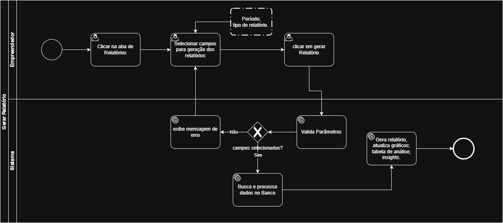
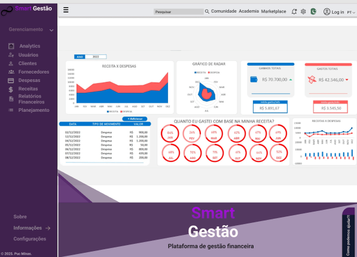

### 3.3.2 Processo 2 – Gerar Relatórios

O processo de geração de relatórios permite que o usuário visualize e analise suas informações financeiras de forma organizada. Esta funcionalidade é crucial para o acompanhamento da saúde financeira do MEI, oferecendo diferentes perspectivas através de filtros, gráficos e tabelas detalhadas.

**Fluxo principal:**
1. Usuário acessa a aba de Relatórios.
2. Usuário seleciona filtros de período e tipo de relatório.
3. Usuário clica em "Gerar Relatório".
4. Sistema exibe gráficos e estatísticas financeiras.
5. Sistema exibe tabela de análise detalhada.
6. Sistema exibe insights financeiros relevantes.

## **Modelo BPMN:**



## **Wireframe (esboço previo da tela)**




## 2. Detalhamento das Atividades

### 2.1. Atividade 1 – Selecionar Filtros de Relatório (Usuário)

Esta atividade permite ao usuário definir os parâmetros para a geração do relatório financeiro.

#### Campos e Elementos

| Campo/Elemento | Tipo | Restrições |
| :--- | :--- | :--- |
| Período | Seleção Única | Obrigatório. Opções: Últimos 30 dias, Este mês, Mês passado, Trimestre atual, Semestre atual, Ano atual. |
| Tipo de Relatório | Seleção Única | Obrigatório. Opções: Resumo Financeiro, Despesas por Categoria, Fluxo de Caixa, Comparativo Mensal. |
| Botão: Gerar Relatório | Botão | Habilitado após a seleção dos filtros. |

#### Comandos de Interação

*   Selecionar uma opção no dropdown "Período".
*   Selecionar uma opção no dropdown "Tipo de Relatório".
*   Clicar no botão "Gerar Relatório" para processar as seleções.

---

### 2.2. Atividade 2 – Visualizar Gráficos e Estatísticas (Sistema)

Após a geração, o sistema apresenta os dados de forma visual para facilitar a compreensão.

#### Campos e Elementos

| Campo/Elemento | Tipo | Restrições |
| :--- | :--- | :--- |
| Gráfico: Receitas vs Despesas | Gráfico de Barras | Exibe comparativo de receitas e despesas. Pode ser filtrado por Mensal, Trimestral, Anual. |
| Gráfico: Despesas por Categoria | Gráfico de Pizza | Exibe a proporção das despesas por categoria. |

#### Comandos de Interação

*   O sistema exibe automaticamente os gráficos com base nos filtros selecionados.
*   O usuário pode selecionar o período de visualização para o gráfico de Receitas vs Despesas (Mensal, Trimestral, Anual).

---

### 2.3. Atividade 3 – Analisar Tabela Detalhada (Sistema)

Uma tabela fornece uma visão pormenorizada dos dados financeiros.

#### Campos e Elementos

| Campo/Elemento | Tipo | Restrições |
| :--- | :--- | :--- |
| Tabela: Análise Detalhada | Tabela | Exibe Categoria, Orçamento, Realizado, Variação e % do Total. |

#### Comandos de Interação

*   O sistema preenche a tabela com os dados detalhados do período e tipo de relatório selecionados.

---

### 2.4. Atividade 4 – Consultar Insights Financeiros (Sistema)

O sistema oferece insights automáticos para destacar pontos importantes da análise financeira.

#### Campos e Elementos

| Campo/Elemento | Tipo | Restrições |
| :--- | :--- | :--- |
| Insight: Bom trabalho nas vendas! | Texto | Mensagem positiva sobre aumento de receitas. |
| Insight: Atenção com materiais | Texto | Alerta sobre orçamento excedido em materiais. |
| Insight: Meta próxima | Texto | Informação sobre proximidade de meta. |

#### Comandos de Interação

*   O sistema gera e exibe insights contextuais baseados nos dados financeiros.

---

## 3. Tipos de Dados Utilizados

*   **Área de texto** - campo texto de múltiplas linhas
*   **Caixa de texto** - campo texto de uma linha
*   **Número** - campo numérico
*   **Data** - campo do tipo data (dd-mm-aaaa)
*   **Hora** - campo do tipo hora (hh:mm:ss)
*   **Data e Hora** - campo do tipo data e hora (dd-mm-aaaa, hh:mm:ss)
*   **Imagem** - campo contendo uma imagem
*   **Seleção única** - campo com várias opções de valores que são mutuamente exclusivas (radio button ou combobox)
*   **Seleção múltipla** - campo com várias opções que podem ser selecionadas mutuamente (checkbox ou listbox)
*   **Arquivo** - campo de upload de documento
*   **Link** - campo que armazena uma URL
*   **Tabela** - campo formado por uma matriz de valores

---

## 4. Comandos Git para o Projeto APN

Os comandos a seguir são sugeridos para inicializar o repositório Git e adicionar os arquivos do projeto (`APN.zip` descompactado) para controle de versão.

**Arquivos do Projeto:**
- `APN/cadastro.html`
- `APN/index.html`
- `APN/login.html`
- `APN/metas.html`
- `APN/perfil.html`
- `APN/relatorios.html`
- `APN/style.css`
- `APN/transacoes.html`

```bash
# 1. Inicializa um novo repositório Git no diretório raiz do projeto
git init

# 2. Adiciona todos os arquivos do projeto ao stage
# (Assumindo que os arquivos estão no diretório 'APN/')
git add APN/

# OU, se você estiver no diretório raiz e quiser adicionar todos os arquivos
# git add .

# 3. Confirma (commit) os arquivos adicionados com uma mensagem descritiva
git commit -m "Commit inicial: Adição de todas as páginas HTML e folha de estilo CSS do projeto APN"

# 4. (Opcional) Adiciona um repositório remoto (ex: GitHub)
# Substitua <URL_DO_SEU_REPOSITORIO> pela URL real
# git remote add origin <URL_DO_SEU_REPOSITORIO>

# 5. (Opcional) Envia (push) o código para o repositório remoto
# git push -u origin main

