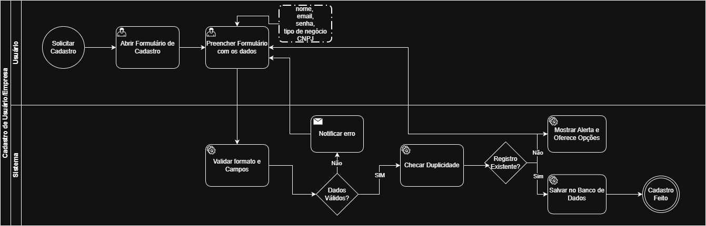

### 3.3.3 Processo 3: Cadastro de Empresa

O processo de cadastro de empresa permite que novos usuários criem uma conta no sistema, fornecendo suas informações básicas e detalhes sobre o tipo de negócio. Esta etapa é fundamental para que o usuário possa começar a utilizar as funcionalidades de controle de despesas.

**Fluxo principal:**
1. Usuário acessa a página de criação de conta.
2. Usuário preenche os dados cadastrais.
3. Usuário clica em "Criar Conta".
4. Sistema valida os dados fornecidos.
5. Sistema cria a nova conta.
6. Usuário é redirecionado para a página de login ou dashboard.

## **Modelagem BPMN:**


## **Wireframe (esboço previo da tela)**


---


> **Ponto de Melhoria (Revisado por Heron):** Olá, equipe! Para alinhar esta documentação com o formulário de cadastro real (`cadastro.html`) e a lógica do backend, peço ao responsável que ajuste a "Atividade 1 – Preencher Dados Cadastrais" abaixo.
> 
> **Guia para o ajuste:**
> 1.  **Ajustar a Tabela de Campos:** Na tabela, remova a linha referente ao `Tipo de Negócio` e adicione duas novas linhas: uma para `Nome da Empresa` (Texto, Obrigatório) e outra para `CNPJ` (Texto, Obrigatório).
> 2.  **Ajustar a Lista de Comandos:** Na lista de comandos, remova o item sobre "Selecionar o tipo de negócio" e adicione os comandos para "Inserir o nome da empresa" e "Inserir o CNPJ".

--- 

# Documentação do Processo: Cadastro de Empresa (Corrigido)

Este documento detalha o processo de **Cadastro de Empresa**, incluindo o fluxo principal, o detalhamento das atividades, campos, comandos de interação e os comandos Git sugeridos para a gestão do código-fonte.

## 1. Processo 3: Cadastro de Empresa

O processo de cadastro de empresa permite que novos usuários criem uma conta no sistema, fornecendo suas informações básicas e detalhes sobre o tipo de negócio. Esta etapa é fundamental para que o usuário possa começar a utilizar as funcionalidades de controle de despesas.

### Fluxo Principal

1.  Usuário acessa a página de criação de conta.
2.  Usuário preenche os dados cadastrais.
3.  Usuário clica em "Criar Conta".
4.  Sistema valida os dados fornecidos.
5.  Sistema cria a nova conta.
6.  Usuário é redirecionado para a página de login ou dashboard.


## 2. Detalhamento das Atividades

### 2.1. Atividade 1 – Preencher Dados Cadastrais (Usuário)

Esta atividade envolve o preenchimento das informações necessárias para a criação da conta. **(Tabela e Comandos ajustados conforme feedback do gestor de RH)**

#### Campos e Elementos (Ajustados)

| Campo/Elemento | Tipo | Restrições |
| :--- | :--- | :--- |
| Nome Completo | Texto | Obrigatório. Campo de texto. |
| E-mail | E-mail | Obrigatório. Formato de e-mail válido. |
| Senha | Senha | Obrigatório. Mínimo de 6 caracteres. |
| Confirmar Senha | Senha | Obrigatório. Deve ser idêntica à senha. |
| **Nome da Empresa** | **Texto** | **Obrigatório.** |
| **CNPJ** | **Texto** | **Obrigatório.** |

#### Comandos de Interação (Ajustados)

*   Inserir o nome completo no campo "Nome Completo".
*   Inserir o endereço de e-mail no campo "E-mail".
*   Inserir a senha no campo "Senha".
*   Inserir a senha novamente no campo "Confirmar Senha".
*   **Inserir o nome da empresa no campo "Nome da Empresa".**
*   **Inserir o CNPJ no campo "CNPJ".**

---

### 2.2. Atividade 2 – Criar Conta (Usuário)

Após preencher os dados, o usuário finaliza o processo de criação da conta.

#### Campos e Elementos

| Campo/Elemento | Tipo | Restrições |
| :--- | :--- | :--- |
| Botão: Criar Conta | Botão | Habilitado após o preenchimento de todos os campos obrigatórios e validação. |

#### Comandos de Interação

*   Clicar no botão "Criar Conta".

---

### 2.3. Atividade 3 – Navegar para Login (Opcional) (Usuário)

Caso o usuário já possua uma conta, ele pode optar por fazer login.

#### Campos e Elementos

| Campo/Elemento | Tipo | Restrições |
| :--- | :--- | :--- |
| Link: Fazer login | Link | Redireciona para a página de login. |

#### Comandos de Interação

*   Clicar no link "Fazer login".

---

## 3. Comandos Git para o Projeto APN

Os comandos a seguir são sugeridos para inicializar o repositório Git e adicionar os arquivos do projeto (`APN.zip` descompactado) para controle de versão.

**Arquivos do Projeto:**
- `APN/cadastro.html`
- `APN/index.html`
- `APN/login.html`
- `APN/metas.html`
- `APN/perfil.html`
- `APN/relatorios.html`
- `APN/style.css`
- `APN/transacoes.html`

```bash
# 1. Inicializa um novo repositório Git no diretório raiz do projeto
git init

# 2. Adiciona todos os arquivos do projeto ao stage
# (Assumindo que os arquivos estão no diretório 'APN/')
git add APN/

# OU, se você estiver no diretório raiz e quiser adicionar todos os arquivos
# git add .

# 3. Confirma (commit) os arquivos adicionados com uma mensagem descritiva
git commit -m "Commit inicial: Adição de todas as páginas HTML e folha de estilo CSS do projeto APN"

# 4. (Opcional) Adiciona um repositório remoto (ex: GitHub)
# Substitua <URL_DO_SEU_REPOSITORIO> pela URL real
# git remote add origin <URL_DO_SEU_REPOSITORIO>

# 5. (Opcional) Envia (push) o código para o repositório remoto
# git push -u origin main
