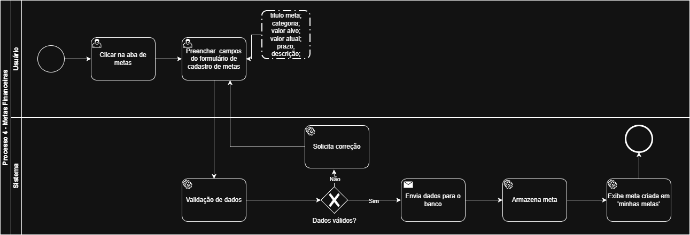

### 3.3.4 Processo 4: Criação de metas

O processo de criação de metas permite que os usuários definam objetivos financeiros ou de gestão dentro do sistema, fornecendo informações básicas como nome da meta, valor desejado e prazo. Esta etapa é fundamental para que o usuário possa acompanhar seu progresso e utilizar as funcionalidades de controle de despesas e receitas.

**Fluxo principal:**
1. O usuário acessa a página de criação de metas.
2. O usuário preenche os dados da meta.
3. O usuário clica em “Salvar Meta”.
4. O sistema valida e registra a nova meta.
5. O usuário é redirecionado para a tela de listagem de metas.

---   

Modelagem BPMN: 

## 2. Campos e Comandos para Criação de Metas (Processo 4)

A criação de uma nova meta é realizada através de um formulário. O processo exige o preenchimento de campos específicos e a execução de comandos de interação para salvar a meta no sistema.

### 2.1. Campos e Elementos do Formulário

| Campo/Elemento | Tipo | Restrições | Descrição |
| :--- | :--- | :--- | :--- |
| **Título da Meta** | Caixa de Texto | Obrigatório | Nome descritivo da meta (Ex: Economizar para novo equipamento). |
| **Categoria** | Seleção Única | Obrigatório | Classificação da meta (Ex: Equipamento, Investimento, Fundo de Emergência, Outro). |
| **Valor Alvo (R$)** | Número | Obrigatório | O valor total que se deseja alcançar. |
| **Valor Atual (R$)** | Número | Opcional | O valor já acumulado para a meta. |
| **Prazo** | Data | Opcional | Data limite para a conclusão da meta. |
| **Descrição** | Área de Texto | Opcional | Detalhes adicionais sobre a meta. |
| **Botão: Criar Meta** | Botão | Habilitado após preenchimento dos campos obrigatórios. | Finaliza e registra a nova meta no sistema. |
| **Botão: Cancelar** | Botão | - | Limpa o formulário e cancela a criação. |

### 2.2. Comandos de Interação

Os comandos de interação representam as ações que o usuário executa para preencher o formulário e submeter a meta:

*   **Inserir o título da meta** no campo "Título da Meta".
*   **Selecionar a categoria** no campo "Categoria".
*   **Inserir o valor desejado** no campo "Valor Alvo (R$)".
*   **Inserir o valor atual** da meta no campo "Valor Atual (R$)" (se aplicável).
*   **Selecionar a data limite** no campo "Prazo".
*   **Inserir a descrição** no campo "Descrição (Opcional)".
*   **Clicar no botão "Criar Meta"** para salvar.
*   **Clicar no botão "Cancelar"** para limpar o formulário.

## 3. Comandos para Gestão e Visualização de Metas (Processo 5)

Após a criação, as metas são listadas e podem ser gerenciadas. O processo de gestão envolve a filtragem da lista e ações específicas em cada item.

### 3.1. Comandos de Filtragem e Visualização

| Campo/Elemento | Tipo | Descrição | Comando de Interação |
| :--- | :--- | :--- | :--- |
| **Botão: Todas** | Botão | Filtra para exibir todas as metas, independentemente do status. | Clicar no botão "Todas". |
| **Botão: Em Andamento** | Botão | Filtra para exibir metas ativas e não concluídas. | Clicar no botão "Em Andamento". |
| **Botão: Concluídas** | Botão | Filtra para exibir metas que já atingiram o valor alvo. | Clicar no botão "Concluídas". |
| **Cartão de Meta** | Elemento de Lista | Exibe Título, Status, Progresso (Valor Atual/Alvo), Prazo/Conclusão e Categoria. | Visualização passiva. |

### 3.2. Comandos de Interação por Meta

Cada meta listada possui botões de ação que permitem a interação direta do usuário:

| Campo/Elemento | Tipo | Restrições | Comando de Interação |
| :--- | :--- | :--- | :--- |
| **Botão: Editar** | Botão | Disponível para metas "Em Andamento". | Clicar no botão "Editar" para modificar a meta. |
| **Botão: Detalhes** | Botão | Disponível para todas as metas. | Clicar no botão "Detalhes" para ver informações completas. |
| **Botão: Reativar** | Botão | Disponível para metas "Concluídas". | Clicar no botão "Reativar" para alterar o status para "Em Andamento". |
