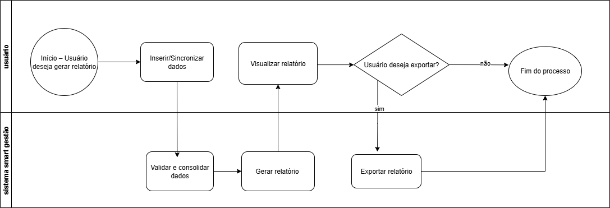

### 3.3.2 Processo 2 – Geração de Relatórios Financeiros

Atualmente, muitos microempreendedores têm dificuldade em analisar suas finanças, já que os registros ficam dispersos em cadernos ou planilhas sem padrão. O Smart Gestão oferece a possibilidade de consolidar automaticamente as informações, permitindo gerar relatórios organizados, categorizados e atualizados em tempo real, dando maior clareza sobre lucros, gastos e saldo disponível.

#### Detalhamento das atividades

 No processo de Geração de Relatórios Financeiros, o usuário inicia informando ou sincronizando os dados financeiros provenientes de cadernos, planilhas ou outros sistemas. O sistema valida e consolida essas informações, garantindo consistência, removendo duplicidades e organizando os registros por categorias. Em seguida, é gerado automaticamente um relatório que pode incluir resumo de lucros e gastos, saldo disponível e gráficos de desempenho. O usuário visualiza o relatório, analisa os dados e identifica insights financeiros. Ao final, ele decide se deseja exportar ou salvar o relatório; caso positivo, o sistema permite a exportação em PDF, Excel ou outros formatos, encerrando o processo.

_Os tipos de dados a serem utilizados são:_

_* **Área de texto** - campo texto de múltiplas linhas_

_* **Caixa de texto** - campo texto de uma linha_

_* **Número** - campo numérico_

_* **Data** - campo do tipo data (dd-mm-aaaa)_

_* **Hora** - campo do tipo hora (hh:mm:ss)_

_* **Data e Hora** - campo do tipo data e hora (dd-mm-aaaa, hh:mm:ss)_

_* **Imagem** - campo contendo uma imagem_

_* **Seleção única** - campo com várias opções de valores que são mutuamente exclusivas (tradicional radio button ou combobox)_

_* **Seleção múltipla** - campo com várias opções que podem ser selecionadas mutuamente (tradicional checkbox ou listbox)_

_* **Arquivo** - campo de upload de documento_

_* **Link** - campo que armazena uma URL_

_* **Tabela** - campo formado por uma matriz de valores_

**1-Selecionar Período do Relatório**

| **Campo**       | **Tipo**         | **Restrições** | **Valor default** |
| ---             | ---              | ---            | ---               |
| [Nome do campo] | [tipo de dados]  |                |                   |
| ***Exemplo:***  |                  |                |                   |
| Data Inicial    | Data             | Obrigatório    |Primeiro dia do mês atual| formato de e-mail |     
| Data Final      | Data             | Obrigatório    |Último dia do mês atual|
|Tipo de Relatório| Seleção única    |Opções: Despesas, Receitas, Consolidado |Consolidado|

| **Comandos**         |  **Destino**                   | **Tipo**           |
| ---                  | ---                            | ---                |
| [Nome do botão/link] | Atividade/processo de destino  | (default/cancel/  )|
| ***Exemplo:***       |                                |                    |
| Continuar            | Filtrar Dados                  | padrão             |
| Cancelar             | Fim do processo                |                    |cancelar

**2-Filtrar Dados**

| **Campo**          | **Tipo**         | **Restrições**                                     | **Valor default** |
| ---                | ---              | ---                                                | ---               |
| [Nome do campo]    | [tipo de dados]  |                                                    |                   |
| Categorias         |Seleção múltipla  |Opcional (alimentação, transporte, fornecedores etc.)|Todas
| Formas de Pagamento|Seleção múltipla  |Opcional (cartão, dinheiro, pix etc.)                |Todas

| **Comandos**         |  **Destino**                   | **Tipo**           |
| ---                  | ---                            | ---                |
| [Nome do botão/link] | Atividade/processo de destino  | (default/cancel/  )|
|  Aplicar Filtros     |    Gerar Relatório             |  padrão            |
|Voltar                |Selecionar Período              |cancelar            |

